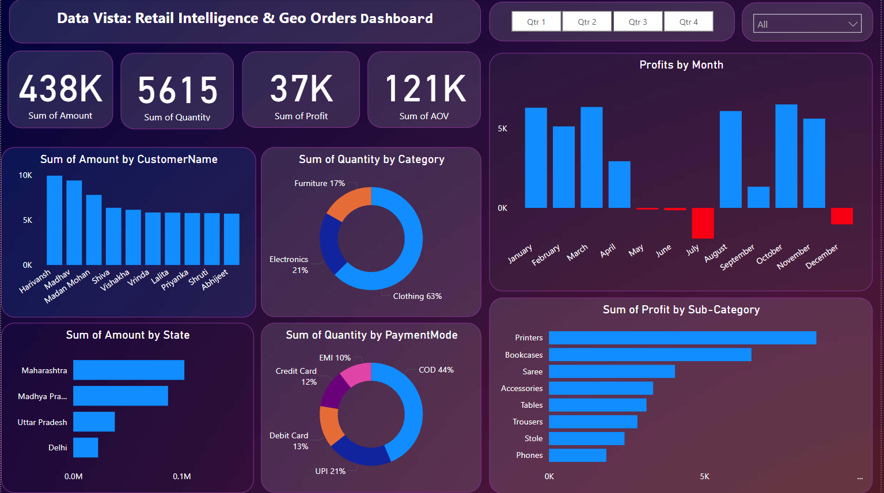

# DataVista_Retail_Intelligence_-_Geo-Order_Dashboard
Dashboard built using Power BI, where I visualized geo-based order insights to drive better business decisions

# 📊 DataVista Geo Order Dashboard – Power BI Project

This Power BI report is built to visualize and analyze sales order data across multiple regions, with interactive elements for filtering and insights.

## 🔍 Features
- Regional Sales & Profit breakdown
- Category & Sub-category analysis
- Payment Mode insights
- Clean UI/UX and slicers for dynamic filtering

## 📁 Files
- `DataVista_Dashboard.pbix` – Main Power BI report
- `Screenshots` – Dashboard visuals
- `SampleData.csv` – Sample dataset

## 📸 Preview

## 💡 Tools Used
- Power BI
- DAX
- Data Modeling
- Excel (for data prep)

## 📬 Let’s Connect!
Feel free to share your feedback or connect with me on [LinkedIn](https://www.linkedin.com/in/deemisofficial/).
